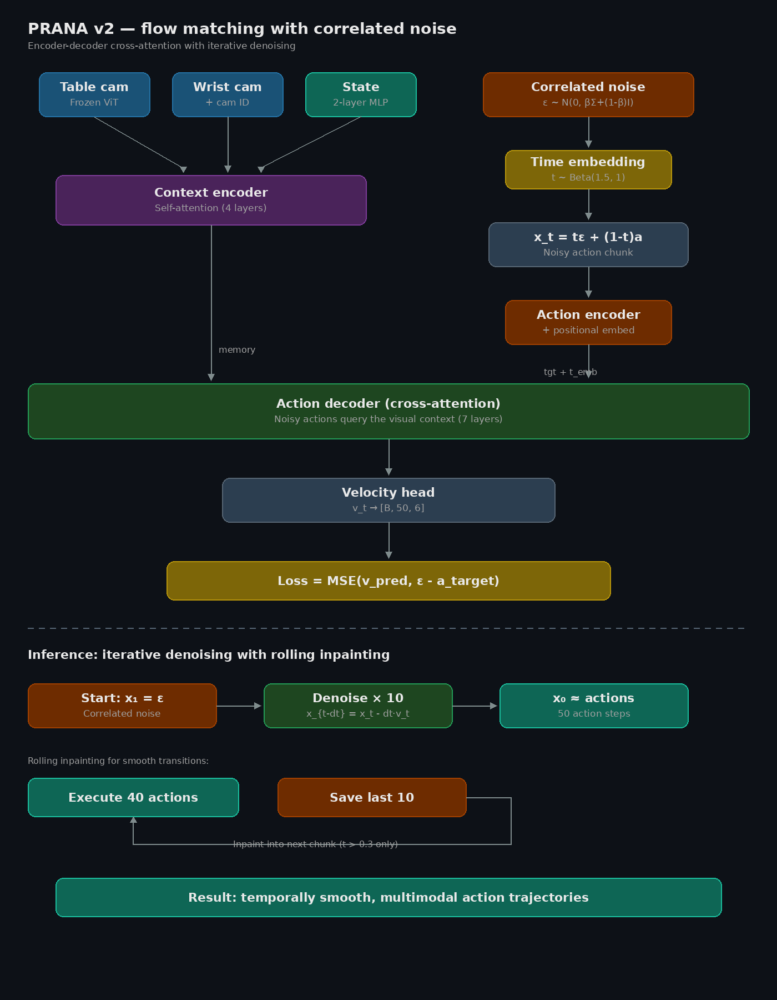
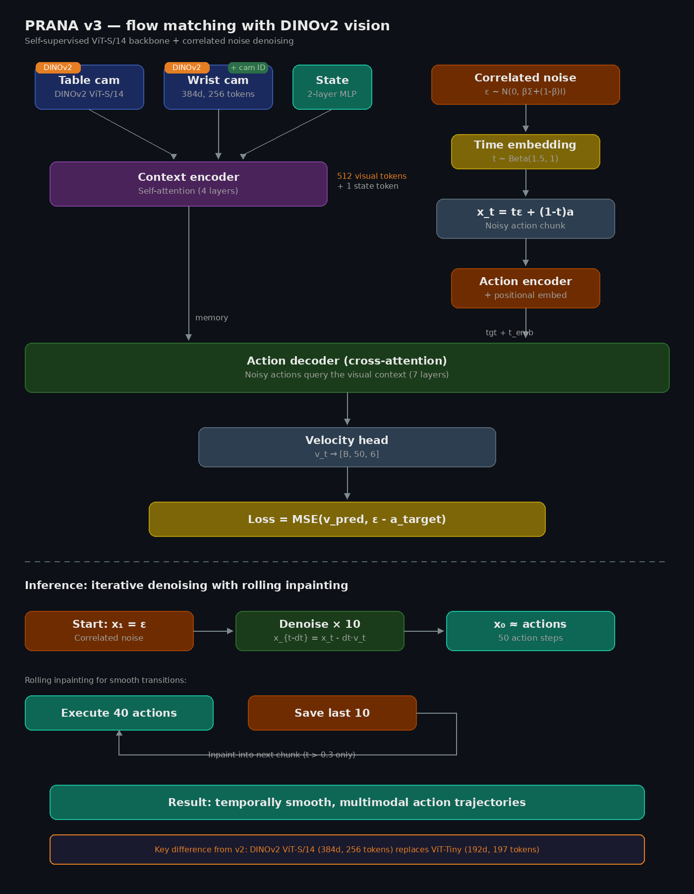

# PRANA

**Policy for Robotic Action via Neural Architecture**

PRANA is a vision-action policy for autonomous robot manipulation, evolving from deterministic action chunking (v1) to flow matching with correlated noise (v2/v3).

[](https://huggingface.co/Siddarth09/PRANA_v2)
[](https://huggingface.co/datasets/Siddarth09/PRANA)
[](https://github.com/huggingface/lerobot)

**DATASET**: https://huggingface.co/datasets/Siddarth09/PRANA

**TASK**: Pick a screwdriver and place it in the box

https://github.com/user-attachments/assets/1ceb2238-2c40-4b45-88dc-5e6f3a075ec1

---

## Models

| Version | Action Head | Vision Backbone | Key Innovation | Status |
|---------|-----------|----------------|---------------|--------|
| [**v1**](#prana-v1) | L1 regression | ViT-Tiny (timm) | Self-attention action chunking | Baseline |
| [**v2**](#prana-v2) | Flow matching | ViT-Tiny (timm) | Cross-attention + correlated noise | **Deployed** |
| [**v3**](#prana-v3) | Flow matching | DINOv2 ViT-S/14 | Self-supervised spatial features | Experimental |

---

## Setup

### Prerequisites

- Python 3.12+
- CUDA GPU (tested on RTX 5060 Laptop, 8GB VRAM)
- SO-101 robot arm with LeRobot firmware

### Installation

```bash
python -m venv lerobot_env
source lerobot_env/bin/activate

pip install lerobot==0.5.1
pip install timm wandb av
```

For Blackwell GPUs (RTX 50xx):

```bash
pip install --pre torch torchvision --index-url https://download.pytorch.org/whl/nightly/cu128 --force-reinstall
```

---

## Data Collection

### Scene


### Teleoperation

Use the leader arm to teleoperate the SO-101 follower:

```bash
lerobot-teleoperate \
    --robot.type=so101_follower \
    --robot.port=/dev/ttyACM0 \
    --robot.cameras='{
        "table": {"type": "intelrealsense", "serial_number_or_name": "103422071945", "width": 640, "height": 480, "fps": 30},
        "wrist": {"type": "opencv", "index_or_path": "/dev/video4", "width": 640, "height": 480, "fps": 30}
    }' \
    --teleop.type=so101_leader \
    --teleop.port=/dev/ttyACM1 \
    --display_data=true
```

### Recording Episodes

```bash
lerobot-record \
    --robot.type=so101_follower \
    --robot.port=/dev/ttyACM0 \
    --robot.cameras='{
        "table": {"type": "intelrealsense", "serial_number_or_name": "103422071945", "width": 640, "height": 480, "fps": 30},
        "wrist": {"type": "opencv", "index_or_path": "/dev/video4", "width": 640, "height": 480, "fps": 30}
    }' \
    --teleop.type=so101_leader \
    --teleop.port=/dev/ttyACM1 \
    --dataset.repo_id=Siddarth09/PRANA \
    --dataset.single_task="Pick the screwdriver and place it in the box" \
    --dataset.num_episodes=20 \
    --dataset.episode_time_s=25 \
    --dataset.reset_time_s=10 \
    --dataset.fps=30 \
    --display_data=true \
    --dataset.push_to_hub=false
```


#### Tips for Recording

1. Place all cameras at their designated locations
2. Get comfortable with the task via teleoperation first
3. Start the recorder and wait for "Episode # recording" audio
4. Complete the entire task within each episode
5. Watch the wrist camera in the Rerun viewer for better control

We collected **123 episodes** total (83 initial + 40 focused on grasp/release).

---

## PRANA v1

Deterministic action chunking transformer (baseline).

### Architecture

All tokens (vision + state + language + action queries) are concatenated and processed through a single self-attention transformer. Predicts action chunks via L1 regression.

| Component | Details |
|---|---|
| Vision | ViT-Tiny (unfrozen) |
| Transformer | 4-layer encoder, self-attention only |
| Action head | L1 regression |
| Language | 256K vocab embedding (unused — receives zeros) |
| Chunk size | 50 |

### Train v1

```bash
python3 prana/train_v1.py \
    --dataset.repo_id=Siddarth09/PRANA \
    --dataset.video_backend=pyav \
    --dataset.image_transforms.enable=false \
    --policy.type=prana_v1 \
    --policy.device=cuda \
    --policy.camera_order='["observation.images.table","observation.images.wrist"]' \
    --batch_size=1 \
    --num_workers=0 \
    --steps=85000 \
    --policy.push_to_hub=false \
    --output_dir=outputs/train/prana \
    --wandb.enable=true
```

### Deploy v1

```bash
python3 prana/deploy_v1.py \
    --robot.type=so101_follower \
    --robot.port=/dev/ttyACM0 \
    --robot.cameras='{"table": {"type": "intelrealsense", "serial_number_or_name": "103422071945", "width": 640, "height": 480, "fps": 30}, "wrist": {"type": "opencv", "index_or_path": "/dev/video4", "width": 640, "height": 480, "fps": 30}}' \
    --display_data=true \
    --dataset.repo_id=Siddarth09/eval_prana_pick_place \
    --dataset.num_episodes=5 \
    --dataset.single_task="Pick the screwdriver and place it in the box" \
    --dataset.push_to_hub=false \
    --policy.path=outputs/train/prana/checkpoints/last/pretrained_model \
    --policy.device=cuda
```

### v1 Limitations

- Self-attention bottleneck — action queries pollute each other before seeing visual context
- No positional embeddings on action queries
- Deterministic output — learns average of demos, fails with multimodal actions
- Unfrozen ViT overfits with limited data
- Language encoder wastes 262MB of parameters

---

## PRANA v2

Flow matching with correlated noise and cross-attention decoder. **Recommended model.**

### Architecture

<p align="center">
  
</p>

**Context path:** Frozen ViT-Tiny encodes table + wrist images with camera-ID embeddings. Concatenated with state token and processed through a 4-layer self-attention context encoder.

**Flow matching path:** Correlated noise ε ~ N(0, βΣ+(1-β)I) is sampled from the empirical action covariance, combined with target actions at timestep t, then projected through the action encoder with positional embeddings.

**Decoder:** Noisy action tokens cross-attend to visual context (7-8 layers), producing velocity predictions. Loss = MSE(v_pred, ε - a_target).

**Inference:** 10 Euler denoising steps from correlated noise → actions. Rolling inpainting (execute 40, save 10) for smooth transitions.

| Component | Details |
|---|---|
| Vision | ViT-Tiny (frozen) + camera ID embed |
| Context encoder | 4 self-attention layers |
| Action decoder | 7-8 cross-attention layers |
| Action head | Flow matching (10 denoise steps) |
| Noise | Correlated, β=0.5 |
| Chunk size | 50 |
| Hidden dim | 256 |
| Trainable params | ~11M |

### Train v2

```bash
python3 prana_v2/train_v2.py \
    --dataset.repo_id=Siddarth09/PRANA \
    --dataset.video_backend=pyav \
    --dataset.image_transforms.enable=false \
    --policy.type=prana_v2 \
    --policy.device=cuda \
    --policy.camera_order='["observation.images.table","observation.images.wrist"]' \
    --batch_size=8 \
    --num_workers=0 \
    --steps=100000 \
    --policy.push_to_hub=false \
    --output_dir=outputs/train/prana_v2 \
    --wandb.enable=true
```

### Fit Correlated Noise (required after training)

```bash
python3 prana_v2/fit_noise.py \
    --dataset Siddarth09/PRANA \
    --checkpoint outputs/train/prana_v2/checkpoints/last/pretrained_model
```

> **⚠️ Critical step.** Without fitting the noise sampler, the robot will be jittery. This computes the action covariance matrix and patches the Cholesky factor into the checkpoint.

### Deploy v2

```bash
python3 prana_v2/deploy_v2.py \
    --robot.type=so101_follower \
    --robot.port=/dev/ttyACM0 \
    --robot.cameras='{"table": {"type": "intelrealsense", "serial_number_or_name": "103422071945", "width": 640, "height": 480, "fps": 30}, "wrist": {"type": "opencv", "index_or_path": "/dev/video4", "width": 640, "height": 480, "fps": 30}}' \
    --display_data=false \
    --dataset.fps=10 \
    --dataset.repo_id=Siddarth09/eval_prana_v2 \
    --dataset.num_episodes=5 \
    --dataset.single_task="Pick the screwdriver and place it in the box" \
    --dataset.push_to_hub=false \
    --policy.path=outputs/train/prana_v2/checkpoints/last/pretrained_model \
    --policy.device=cuda
```

### v2 Deployment Tips

| Tip | Why |
|-----|-----|
| `--dataset.fps=10` | Matches camera throughput, prevents frame drops |
| `--display_data=false` | Saves CPU for inference |
| Denoise steps = 5 | Faster inference without retraining (edit config) |
| Fit noise sampler | Reduces jitter significantly |

### v2 Inference Speed

| Operation | Time |
|-----------|------|
| Chunk prediction (10 denoise steps) | ~22ms |
| Queued action (from buffer) | ~0.5ms |
| Camera capture (2 cameras) | ~100ms |

---

## PRANA v3

Flow matching with DINOv2 self-supervised vision backbone.

### Architecture

<p align="center">
  
</p>

Identical to v2 except the vision backbone — uses **DINOv2 ViT-S/14** which provides self-supervised spatial features (384d, 256 tokens per camera) instead of ImageNet-supervised ViT-Tiny (192d, 197 tokens).

| What changed | v2 | v3 |
|---|---|---|
| Vision backbone | ViT-Tiny (timm) | DINOv2 ViT-S/14 (torch.hub) |
| Embed dimension | 192 | 384 (2x) |
| Tokens per camera | 197 | 256 |
| Total visual tokens | 394 | 512 |
| Backbone params | 5.7M | 22M |
| Trainable params | ~11M | ~30M |

> **Note:** DINOv2 requires ~1.5GB more VRAM. Batch size 8 uses ~5.5GB on RTX 5060.

### Train v3

```bash
python3 prana_v3/train_v3.py \
    --dataset.repo_id=Siddarth09/PRANA \
    --dataset.video_backend=pyav \
    --dataset.image_transforms.enable=false \
    --policy.type=prana_v3 \
    --policy.device=cuda \
    --policy.camera_order='["observation.images.table","observation.images.wrist"]' \
    --batch_size=8 \
    --num_workers=0 \
    --steps=100000 \
    --policy.push_to_hub=false \
    --output_dir=outputs/train/prana_v3 \
    --wandb.enable=true
```

### Deploy v3

```bash
python3 prana_v3/deploy_v3.py \
    --robot.type=so101_follower \
    --robot.port=/dev/ttyACM0 \
    --robot.cameras='{"table": {"type": "intelrealsense", "serial_number_or_name": "103422071945", "width": 640, "height": 480, "fps": 30}, "wrist": {"type": "opencv", "index_or_path": "/dev/video4", "width": 640, "height": 480, "fps": 30}}' \
    --display_data=false \
    --dataset.fps=10 \
    --dataset.repo_id=Siddarth09/eval_prana_v3 \
    --dataset.num_episodes=5 \
    --dataset.single_task="Pick the screwdriver and place it in the box" \
    --dataset.push_to_hub=false \
    --policy.path=outputs/train/prana_v3/checkpoints/080000/pretrained_model \
    --policy.device=cuda
```

---

## Backbone Comparison

The v2 encoder auto-detects backbone type, so you can experiment by changing one line in `configuration_prana.py`:

```python
# ViT-Tiny (default, 5.7M, 197 tokens/cam)
vision_backbone: str = "vit_tiny_patch16_224"

# DINOv2 via timm (22M, 256 tokens/cam)
vision_backbone: str = "vit_small_patch14_dinov2"

# ConvNeXt CNN (28M, 49 tokens/cam)
vision_backbone: str = "convnext_tiny"

# ViT-Small (22M, 197 tokens/cam)
vision_backbone: str = "vit_small_patch16_224"
```

---

## How Flow Matching Works

Standard imitation learning predicts actions via regression (L1/MSE), which learns the **average** of demonstrations. Flow matching instead learns the **velocity field** that transforms noise into valid trajectories:

1. **Training:** Interpolate noise ε and target actions a at time t: `x_t = t·ε + (1-t)·a`. Predict velocity v_t. Loss = `MSE(v_t, ε - a)`.
2. **Inference:** Start from correlated noise, take 10 Euler steps: `x_{t-dt} = x_t - dt·v_t`. Result ≈ valid action trajectory.

**Correlated noise** (from empirical action covariance) makes denoising easier — the starting noise already has temporal smoothness and joint coordination of real trajectories.

---

## Results

| Metric | v1 | v2 | v3 |
|--------|----|----|-----|
| Training loss | 0.334 (L1) | 0.50 (MSE) | 0.50 (MSE) |
| Reaches screwdriver | Yes | Yes | Yes |
| Grasps screwdriver | With assistance | Yes | Yes |
| Places in box | No | With assistance | With assistance |
| Inference speed | ~5ms | ~22ms | ~30ms |
| Trainable params | ~8M | ~11M | ~30M |

---

## Project Structure

```
PRANA/
├── prana_v1/                    # Deterministic baseline
│   └── model/
│       ├── configuration_prana.py
│       ├── encoders.py
│       ├── modeling.py
│       └── policy_prana.py
├── prana_v2/                    # Flow matching (recommended)
│   ├── model/
│   │   ├── configuration_prana.py
│   │   ├── encoders.py
│   │   ├── modeling.py
│   │   └── policy_prana.py
│   ├── train_v2.py
│   ├── deploy_v2.py
│   └── fit_noise.py
├── prana_v3/                    # DINOv2 backbone
│   ├── model/
│   │   ├── configuration_prana.py
│   │   ├── encoder.py
│   │   ├── modeling.py
│   │   └── policy_prana.py
│   ├── train_v3.py
│   └── deploy_v3.py
├── assets/
│   ├── prana_v2_architecture.png
│   └── prana_v3_architecture.png
└── outputs/train/
```

---

## Citation

```bibtex
@misc{dayasagar2026prana,
  title={PRANA: Flow Matching with Correlated Noise for Low-Data Robot Manipulation},
  author={Dayasagar, Siddarth},
  year={2026},
  url={https://github.com/siddarth09/PRANA}
}
```

## Acknowledgments

- [LeRobot](https://github.com/huggingface/lerobot) by Hugging Face
- Flow matching inspired by [BEHAVIOR 2025 1st place solution](https://arxiv.org/abs/2512.06951)
- Built at Northeastern University

## License

MIT